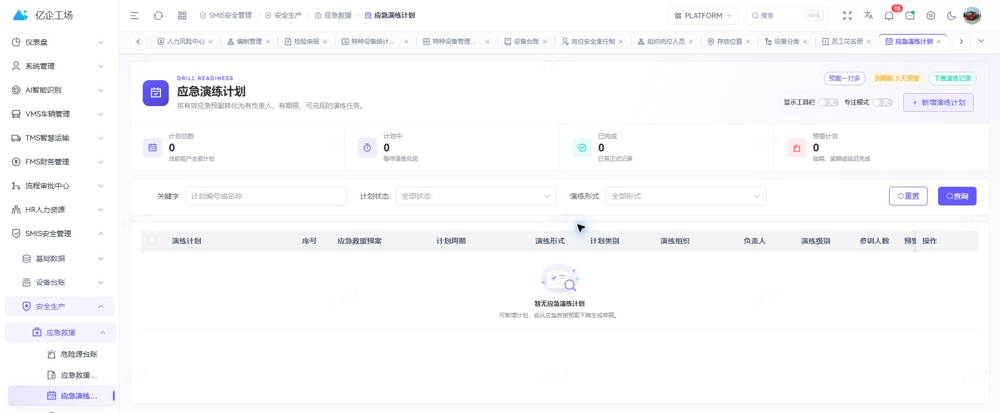
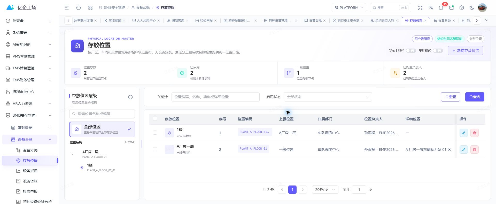

<div align="center">
  <h1>Art Supabase SMIS</h1>
  <p><strong>面向企业安全生产、设备治理与人员资质的一体化管理应用</strong></p>
  <p>连接安全基础资料、设备台账、资质培训、应急救援、反违章、劳动防护与事故闭环。</p>

  <p>
    <a href="https://gitee.com/wangyanghub/art-supabase-smis">Gitee</a>
    ·
    <a href="https://github.com/869123771/art-supabase-smis">GitHub</a>
    ·
    <a href="https://gitee.com/wangyanghub/art-supabase-pro">主平台</a>
    ·
    <a href="https://869123771.github.io/art-supabase-doc/modules/smis">使用文档</a>
  </p>
</div>

## 项目定位

Art Supabase SMIS 是 Art Supabase Pro 的安全生产管理业务应用。当前版本已经从早期空壳重建为覆盖安全主数据、设备设施、人员资质与生产安全过程的业务模块，并持续补齐流程和统计能力。

本仓只维护 SMIS 页面、业务 API、领域类型与适配代码。认证、租户、权限、菜单、布局、路由、公共组件、Store 和 Supabase 公共客户端由 [`art-supabase-pro`](https://gitee.com/wangyanghub/art-supabase-pro) 统一提供。





## 核心能力

| 领域         | 当前覆盖                                                                 |
| ------------ | ------------------------------------------------------------------------ |
| 安全基础资料 | 检查分类、场所、供应商、岗位风险清单、安全责任、作业指导、假期与请假信息 |
| 设备设施     | 设备分类、存放位置、设备台账、折旧、报检、特种设备台账与分析             |
| 资质培训     | 课程、题库、考试、培训计划、培训记录、统计报表、工种工项与安全资格证书   |
| 应急救援     | 危险源台账、应急预案、演练计划、演练记录与演练报告                       |
| 反违章与文档 | 违章分类、标准库、违章记录、三级教育、公告、安全制度与必知必会           |
| 防护与工器具 | 物资分类、物资信息、个人标准、发放标准、个人申领、领用与归还记录         |
| 事故管理     | 事故快报、工伤申报、事故调查、历史案例与事故统计                         |

## 安全管理闭环

```text
标准 / 风险 / 资质 / 设备基础
  → 计划与日常执行
  → 检查 / 演练 / 培训 / 领用
  → 违章 / 隐患 / 事故处置
  → 调查、整改、复核与统计分析
```

SMIS 用于形成管理记录和处置闭环，不替代法定检验、专业安全判断或监管要求。关键状态变化、跨租户访问和受控写入必须在服务端校验并留痕。

## 独立运行

环境要求：Node.js `>= 22.0.0`、pnpm `>= 11.9.0`。

```powershell
pnpm install
pnpm dev
```

默认访问 `http://localhost:3014`。独立运行时，SMIS 菜单提升为一级入口；由主平台装载时仍保留 SMIS 应用分组。

```powershell
pnpm check
pnpm build
pnpm preview
```

生产构建输出到 `docs/`，默认公共路径为 `/art-supabase-smis/`，可作为 Pages 发布目录。

## 与主仓协作

SMIS 业务修改在本仓提交并推送，数据库迁移和跨模块服务契约按主平台约定治理，随后在主仓更新 `modules/art-supabase-smis` 子模块指针。本仓不复制平台公共运行时，也不直接引用其他业务仓前端源码。

## 许可证

本项目采用 [MulanPSL-2.0](LICENSE) 许可证。
